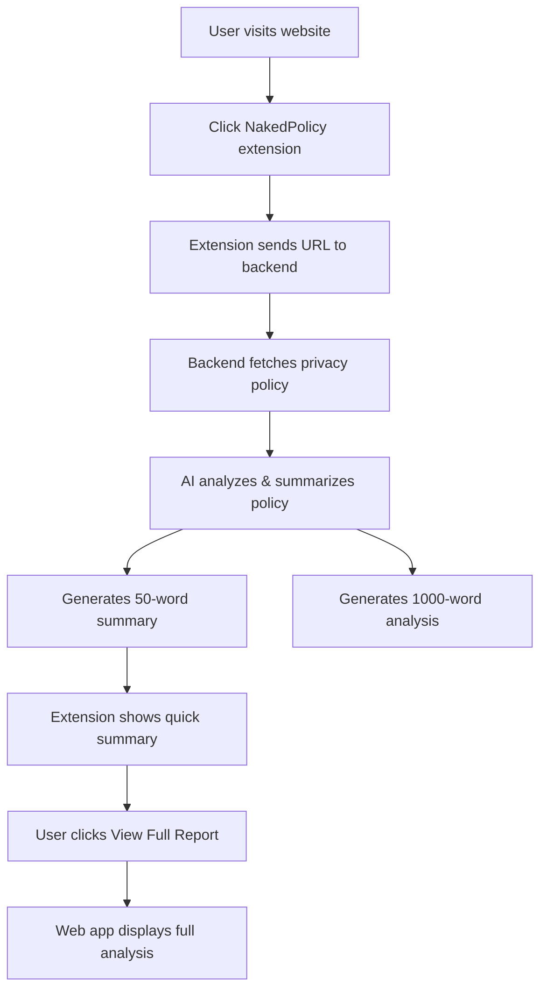

# 🔍 NakedPolicy
**Privacy Policies. Terms. Cookies. Simplified.**

NakedPolicy is an intelligent browser extension that breaks down complex legal documents — **privacy policies, terms & conditions, cookie notices, and codes of conduct** — into simple, human-friendly summaries.

Modern digital platforms bury users under pages of legal jargon. **NakedPolicy cuts through the noise** and gives you instant clarity, one line at a time.

---

## 🚨 The Problem It Solves

Every day, millions of users blindly click **"Accept"** without understanding what they’re agreeing to.

Privacy policies and terms are intentionally: 

- 📄 **Long** — Often 10,000+ words  
- ⚖️ **Confusing** — Written in dense legal language  
- 🧠 **Packed with jargon** — Technical and legal terms everywhere  

Because of this, users rarely know:

- ❌ What personal data is collected  
- ❌ How it's used or shared  
- ❌ How long it's stored  
- ❌ What rights they actually have  
- ❌ What cookies and trackers are running in the 

This lack of transparency puts people at risk of **unwanted tracking, data misuse, and unfair terms**.

---

## 💡 How NakedPolicy Helps

NakedPolicy brings transparency to the digital world with:

- ✅ **One-Line Legal Summaries**  
- 🔍 **Clear data collection & sharing insights**  
- 🍪 **Simple cookie explanations**  
- ⚡ **Instant, informed consent decisions**

---

## ✨ Core Features

- 🤖 **Real-time AI Summarization** (Google Gemini)  
- 📊 **Section-wise Breakdown**  
- 🍪 **Cookie & Tracker Detection**  
- 🚨 **Risk Indicators** (high data sharing, profiling, third-party usage)  
- 🎯 **Dual-Mode Summaries**  
  - 50-word quick view  
  - 1000-word detailed analysis  
- 🌐 **Web Application**  
- 🔌 **Chrome Extension**  
- 🎨 **Clean, distraction-free UI**  
- 🌍 **Cross-Browser Support (planned)**  

---

## 🧠 How It Works



---

## 🚀 Quick Start

### 1️⃣ Start Backend
```bash
start-backend.bat
```

### 2️⃣ Start Frontend
```bash
start-frontend.bat
```

### 3️⃣ Use the App
- Web: `http://localhost:5173`
- Extension: Build and load `dist/` in Chrome

---

## 🔧 Setup

### Prerequisites
- Python 3.8+
- Node.js 16+
- Chrome Browser

### Installation

```bash
git clone https://github.com/Swinalwaghmare/NakedPolicy.git
cd NakedPolicy
```

#### Backend
```bash
pip install -r requirements.txt
playwright install chromium
```

#### Frontend
```bash
cd frontend
npm install
```

#### Extension
```bash
npm install
npm run build
```

---

## 🔑 API Key Setup

1. Get API key from **Google AI Studio**
2. Update `app.py`:
```python
api_key = "YOUR_API_KEY_HERE"
```

---

## 📁 Project Structure

```text
NakedPolicy/
├── app.py
├── policy_fetcher_safe.py
├── summary_store.py
├── summaries_db.json
├── frontend/
├── src/
├── public/
├── start-backend.bat
└── start-frontend.bat
```

---

## 🛠️ Tech Stack

**Backend**
- Python, Flask, Flask-CORS  
- Google Gemini AI  
- Playwright  

**Frontend**
- React 18, Vite  
- TailwindCSS  

**Extension**
- TypeScript, React  
- Manifest V3  

---

## 🗺️ Roadmap

- [ ] Multi-Language Support  
- [ ] Risk Scoring  
- [ ] Policy Comparison  
- [ ] Mobile App  
- [ ] Enterprise API  
- [ ] Dark Mode  
- [ ] Export Reports  

---

## 👨‍💻 Contributors

- **Karan Tomar** — Team Leader  
- Swinal Waghmare  
- Harshal Pantawane  
- Anirudh Trivedi  

---

## 📄 License

**MIT License**

---

## 💖 Support

- ⭐ Star the repo  
- 🐛 Report issues  
- 💡 Suggest features  
- 🔀 Contribute  

---

**Bringing transparency to the digital world — one policy at a time.**
